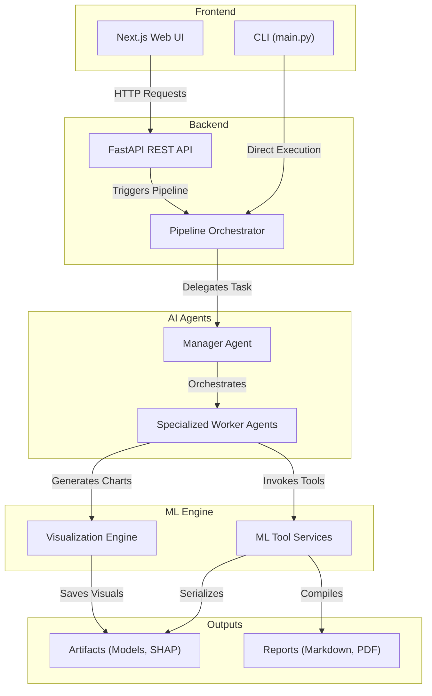

# Axiom - Autonomous Data Scientist


Axiom is an enterprise-grade, multi-agent AI platform that automates the entire machine learning lifecycle. From raw CSV ingestion to model deployment, Axiom autonomously manages data cleaning, feature engineering, model training, error auditing, hyperparameter tuning, and explainability reporting. 

Built with a robust **FastAPI backend** and a modern **Next.js frontend**, Axiom bridges the gap between complex data science workflows and intuitive user experiences.

---

## 🌟 Key Features

- **Multi-Agent Architecture**: Powered by a cooperative swarm of specialized AI agents (Data Collector, Preprocessor, Feature Engineer, Trainer, Auditor, Tuner, Finalizer).
- **End-to-End Automation**: Automatically detects problem types (regression/classification) and executes the optimal pipeline without human intervention.
- **Enterprise Visualizations**: Rich, interactive charts (Correlation Matrices, PCA, Feature Importance, Distributions) rendered in a dark-themed, glassmorphic UI.
- **Explainable AI (XAI)**: Built-in SHAP (SHapley Additive exPlanations) values generation for complete model transparency.
- **Deterministic Execution**: While LLMs drive the reasoning and orchestration (via CrewAI), the core ML execution relies on deterministic, reliable Python tool services.
- **Comprehensive Reporting**: Generates automated markdown and PDF reports summarizing model performance, data quality, and business insights.

---

## 🏗 Architecture



### Core Components
- **`agents/`**: Contains the specialized worker agents (data_collection, preprocessing, feature_engineering, etc.) and the manager agent.
- **`core/`**: Pipeline state management, configuration, model registry, metrics evaluation, and system logging.
- **`visualization/`**: Advanced visualization engine using Seaborn and Matplotlib to generate base64-encoded charts.
- **`frontend/`**: A React/Next.js application utilizing `framer-motion` for smooth UI transitions and TailwindCSS for styling.
- **`api.py`**: FastAPI REST API bridging the frontend and the core ML pipeline.

---

## 🚀 Getting Started

### Prerequisites

Ensure you have the following installed on your system:
- **Python 3.11+**
- **Node.js 20+**
- **Cerebras API Key**: Obtainable from [Cerebras Cloud](https://cloud.cerebras.ai/)

### Installation

**1. Clone the repository**
```bash
git clone https://github.com/your-org/data-ai.git
cd data-ai
```

**2. Backend Setup**
```bash
python -m venv venv
# Windows
venv\Scripts\activate
# macOS/Linux
source venv/bin/activate

pip install -r requirements.txt
```

**3. Environment Configuration**
```bash
cp .env.example .env
```
*Edit `.env` and configure your `CEREBRAS_API_KEY` and `ALLOWED_ORIGINS`.*

**4. Frontend Setup**
```bash
cd frontend
npm install
```

### Running the Application

**Full Stack (Web UI)**
From the `frontend/` directory, launch both the backend and frontend simultaneously:
```bash
npm run dev
```
- **Web UI**: `http://localhost:3000`
- **REST API**: `http://127.0.0.1:8000`

**Headless (CLI)**
Run a pipeline directly from the command line:
```bash
python main.py --data path/to/dataset.csv --target target_column
```

---

## 🔒 Security & Best Practices

Axiom is built with enterprise security in mind:
- **Secrets Management**: All sensitive keys reside in the `.env` file, which is explicitly ignored by Git. **Never commit your API keys.**
- **CORS Policies**: Cross-Origin Resource Sharing is strictly controlled via the `ALLOWED_ORIGINS` environment variable.
- **Authentication**: Utilizes bcrypt for password hashing and secure, URL-safe session tokens with configurable TTLs.
- **Data Isolation**: Run-scoped endpoints require authorization, ensuring users can only access their own experiments and datasets.
- **Input Validation**: Uploaded files and client-supplied paths are rigorously sanitized to prevent path traversal attacks.

---

## 📊 Outputs & Artifacts

Upon pipeline completion, Axiom generates the following outputs:
- **`artifacts/<run_id>/`**: Serialized trained models, performance metrics, run state snapshots, and SHAP value JSONs.
- **`reports/<run_id>/`**: Comprehensive markdown reports detailing the experiment, with options for PDF and Excel exports.
- **`logs/`**: Structured JSON logs for pipeline auditing and debugging.

---

## 🧪 Testing

To run the unit test suite for the core modules:
```bash
pytest
```

---

## 📄 License

This project is licensed under the MIT License. See the [LICENSE](LICENSE) file for details.
